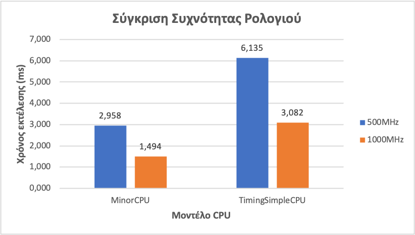
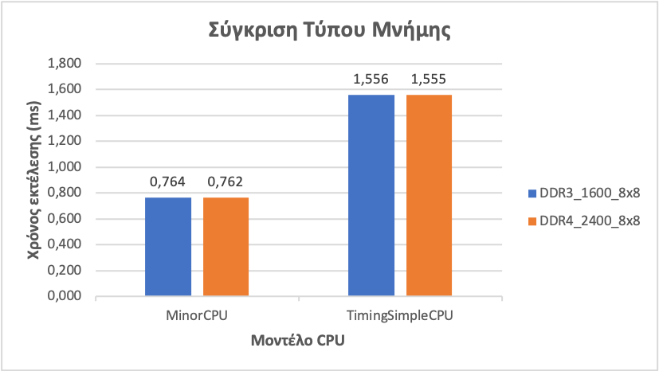

# 1η εργασία Αρχιτεκτονικής Προηγμένων Υπολογιστών
## Συντελεστές (ομάδα 9):
Κυδώνης Ιωάννης, ΑΕΜ: 9407, email: ikydonis@ece.auth.gr  
Ούρδας Αντώνιος, ΑΕΜ: 9358, email: ourdasav@ece.auth.gr

## Ερώτημα 1: Εξοικείωση με τις παραμέτρους του gem5
Κατόπιν μελέτης του αρχείου _configs/example/arm/starter_se.py_ παρατηρούμε ότι προσδιορίζονται παράμετροι του συστήματος σε δύο σημεία. Έχουμε παραμέτρους που προσδιορίζονται σαν ορίσματα που δίνονται κατά την εκτέλεση του προγράμματος (command line arguments) και ερμηνεύονται από τον _ArgumentParser_, οι οποίες είναι:  

| Παράμετρος | Όρισμα Γραμμής Εντολών | Προεπιλεγμένη Τιμή |
| --- | --- | --- |
| Τύπος CPU | --cpu | atomic |
| Συχνότητα CPU | --cpu-freq | 4GHz |
| Αριθμός πυρήνων | --num-cores | 1 |
| Τύπος Μνήμης | --mem-type | DDR3 στα 1600MHz |
| Αριθμός καναλιών Μνήμης | --mem-channels | 2 |
| Αριθμός από ranks ανά κανάλι μνήμης | --mem-ranks | Μη προσδιορισμένη |
| Μέγεθος Μνήμης | --mem-size | 2GB |

Ο δεύτερος τύπος παραμέτρων είναι hardcoded μέσα στο python script και μπορούμε να βρούμε τις εξής:

| Παράμετρος | Όνομα στο κώδικα | Προεπιλεγμένη Τιμή |
| --- | --- | --- |
| Μέγεθος γραμμής cache | cache_line_size | 64 (bytes) |
| Τάση συστήματος | voltage_domain | 3.3V |
| Συχνότητα ρολογιού συστήματος | clk_domain | 1GHz |
| Τάση του CPU Cluster | cpu_cluster | 1.2V |
> **Σημείωση:** το CPU cluster αποτελείται από τους πηρύνες CPU και εν προκειμένω έχει L1 cache πάνω στον κάθε πυρήνα και L2 cache κοινή για όλους τους πηρύνες.

## Ερώτημα 2: Ερμηνεία αποτελεσμάτων εξομοίωσης
### Μέρος A
Στον φάκελο εξόδου της εξομοίωσης βρίσκονται τόσο τα αποτελέσματα της εξομοίωσης όσο και αναλυτικά specifications του συστήματος που εξομοιώνεται. Ο φάκελος εξόδου έχει όνομα _m5out_ ως προεπιλογή και μπορούμε να το τροποποιήσουμε αν στην εντολή που τρέχουμε για την εξομοίωση δώσουμε την παράμετρο _-d όνομα-αρχείου_ στον gem5.
Μέσα στο αρχείο _config.ini_ βλέπουμε τις παρακάτω τιμές που επιβεβαιώνουν το configuration που είχαμε παρατηρήσει στο αρχείο _starter_se.py_ στο ερώτημα 1:
- [system] -> cache_line_size = 64
- [system] -> mem_ranges = 0:2147483648 = 2GB
- [system.voltage_domain] -> voltage = 3.3
- [system.clk_domain] -> clock = 1000
- [system.cpu_cluster.cpus] -> type = MinorCPU
- [system.cpu_cluster.voltage_domain] -> voltage = 1.2
- [system.cpu_cluster.clk_domain] -> clock = 250 -> 250 picoseconds = 1/250 * 1000 GHz = 4 GHz

Κατά την εκτέλεση του gem5 παρατηρήσαμε το εξής warning:  
```warn: DRAM device capacity (8192 Mbytes) does not match the address range assigned (1024 Mbytes)```


Αυτό συμβαίνει γιατί η μνήμη που περιμένει να βρει ανά channel είναι διαφορετική από αυτήν που του έχουμε δώσει.
Η τιμή που του έχουμε δώσει είναι συνολικά 2Gb άρα, 1Gb ανά channel μνήμης.

Μπορούμε να βρούμε την αναμενόμενη τιμή ως εξής (παρατίθενται τα specifications για τον controller 0, αντίστοιχα ισχύουν και για τον controller 1):
- [system.mem_ctrls0.dram] -> ranks_per_channel = 2
- [system.mem_ctrls0.dram] -> devices_per_rank = 8
- [system.mem_ctrls0.dram] -> device_size = 536870912 -> 512 Mb

οπότε έχουμε συνολική μνήμη ανά channel: 2 * 8 * 512Mb = 8192Mb που τυπώνει σαν αναμενόμενη τιμή ο gem5.

### Μέρος B
Ο αριθμός committed instructions φαίνεται στο αρχείο _stats.txt_:

```
system.cpu_cluster.cpus.committedInsts           5028                       # Number of instructions committed
.
.
.
system.cpu_cluster.cpus.fetch2.intInstructions         5487                       # Number of integer instructions successfully decoded
system.cpu_cluster.cpus.fetch2.fpInstructions            0                       # Number of floating point instructions successfully decoded
system.cpu_cluster.cpus.fetch2.vecInstructions            0                       # Number of SIMD instructions successfully decoded
system.cpu_cluster.cpus.fetch2.loadInstructions         1809                       # Number of memory load instructions successfully decoded
system.cpu_cluster.cpus.fetch2.storeInstructions          835                       # Number of memory store instructions successfully decoded
system.cpu_cluster.cpus.fetch2.amoInstructions            0                       # Number of memory atomic instructions successfully decoded
```

Παρατηρούμε ότι τα committed instructions της CPU δεν συμβαδίζουν με τα συνολικά instructions που έγιναν fetch στο στάδιο fetch2 του pipeline. Οπότε συμπεραίνουμε ότι μερικά instructions έγιναν discard αντί για commit μέσα στο pipeline λόγω εσφαλμένου branch prediction.

Πραγματοποιήθηκε επίσης έλεγχος των committed instructions μέσω του command line profiler εργαλείου _perf_. Η δοκιμή έγινε σε ένα _Raspberry Pi 3 Model B_ (το οποίο έχει ARM αρχιτεκτονική) και εκτελέστηκαν οι παρακάτω εντολές (για εγκατάσταση του απαιτούμενου εργαλείου και για τον υπολογισμό των instructions και branch misses):
```
sudo apt-get install linux-tools
sudo perf_4.9 stat -e instructions:u -e branch-misses:u ./hello
```

Χρησιμοποιήθηκαν τα ορίσματα _-e instructions:u -e branch-misses:u_ έτσι ώστε να επιστραφεί ο αριθμός των instructions και των branch misses που συνέβησαν σε επίπεδο χρήστη και όχι σε επίπεδο kernel<sup>[[1]](#πηγές)</sup>.
Με διαδοχικές εκτελέσεις τα αποτελέσματα που επέστρεψε ο profiler ήταν τα παρακάτω:
```
 Performance counter stats for './hello':
              5,896      instructions:u
                370      branch-misses:u

 Performance counter stats for './hello':
              5,896      instructions:u
                377      branch-misses:u

 Performance counter stats for './hello':
              5,890      instructions:u
                374      branch-misses:u
 
 Performance counter stats for './hello':
              5,897      instructions:u
                377      branch-misses:u
 
 Performance counter stats for './hello':
              5,902      instructions:u
                390      branch-misses:u
 
 Performance counter stats for './hello':
              5,904      instructions:u                                              
                394      branch-misses:u
```

Παρατηρούμε ότι και τα αποτελέσματα του _perf_ δείχνουν αυξημένο αριθμό instructions σε σχέση με τα αποτελέσματα του _gem5_ και αυτό επιβεβαιώνει το ότι δεν γίνονται commit όλα τα instructions διότι προκύπτουν και branch prediction misses.

### Μέρος C
Από το αρχείο stats.txt φαίνεται ότι η L2 cache προσπελάστηκε 479 φορές:

```
system.cpu_cluster.l2.overall_accesses::total          479                       # number of overall (read+write) accesses
```

Εναλλακτικά αν δεν δινόταν πληροφορία για τα συνολικά accesses στην L2 cache θα μπορούσαμε να τα υπολογίσουμε από τον αριθμό των misses στην L1 cache (instruction + data) εξαιρώντας τα MSHR hits στην L1 cache.
Τα MSHR hits δηλώνουν ότι η L1 cache επικοινώνησε κατευθείαν με την DRAM χωρίς να μεσολαβήσει η L2 οπότε πρέπει να αφαιρεθούν από τα συνολικά misses της L1 στον υπολογισμό<sup>[[2]](#πηγές)</sup>.  
Οπότε υπολογίζουμε l2_overall_acceses = icache_overall_misses + dcache_overall_misses - dcache_overall_mshr_hits = 332 + 179 - 32 = 479.  
(ή εναλλακτικά l2_overall_acceses = icache_overall_misses + dcache_overall_mshr_misses)
```
system.cpu_cluster.cpus.icache.overall_misses::total          332                       # number of overall misses
system.cpu_cluster.cpus.dcache.overall_misses::total          179                       # number of overall misses
system.cpu_cluster.cpus.dcache.overall_mshr_hits::total           32                       # number of overall MSHR hits
system.cpu_cluster.cpus.dcache.overall_mshr_misses::total          147                       # number of overall MSHR misses
```

## Ερώτημα 3: Εξομοίωση με δικό μας πρόγραμμα C και μελέτη in-order μοντέλων CPU
Στο documentation της ιστοσελίδας του gem5<sup>[[3]](#πηγές)</sup> μπορούμε μεταξύ άλλων να βρούμε πληροφορίες για τα υποστηριζόμενα μοντέλα CPU:
- [SimpleCPU](http://www.gem5.org/documentation/general_docs/cpu_models/SimpleCPU)
- [O3CPU](http://www.gem5.org/documentation/general_docs/cpu_models/O3CPU)
- [TraceCPU](http://www.gem5.org/documentation/general_docs/cpu_models/TraceCPU)
- [MinorCPU](http://www.gem5.org/documentation/general_docs/cpu_models/minor_cpu)

Από αυτά, τα SimpleCPU και MinorCPU είναι in-order μοντέλα:

- SimpleCPU: Είναι ένα in-order μοντέλο CPU με απλή δομή, χωρίς pipeline και χρησιμοποιείται σε περιπτώσεις που δεν χρειαζόμαστε κάποιο σύνθετο μοντέλο όπως για παράδειγμα για να επιβεβαιώσουμε ότι το προγραμμά μας δουλεύει σωστά.\
Έχει 2 εκδοχές, όπου και οι 2 βασίζονται στην κλάση BaseSimpleCPU:
    - AtomicSimpleCPU: Στην εκδοχή αυτή δεν χρησιμοποιείται χρονισμός για την πρόσβαση στη μνήμη και για τον λόγο αυτό δεν παρατηρείται καθυστέρηση κατά την πρόσβαση στη μνήμη από σχηματισμό ουρών. Η προσέγγιση αυτή χρησιμεύει όταν θέλουμε να μελετήσουμε/συγκρίνουμε τον χρόνο εκτέλεσης ενός τμήματος κώδικα απομονωμένο από το υπόλοιπο σύστημα.
    - TimingSimpleCPU: Αντίθετα με το AtomicSimpleCPU μοντέλο, στην εκδοχή αυτή χρησιμοποιείται χρονισμός για την πρόσβαση στη μνήμη. Η εξομοίωση με αυτό το μοντέλο οδηγεί σε πιο ρεαλιστικά συμπεράσματα καθώς λαμβάνει υπόψιν το γεγονός ότι χρησιμοποιούνται πόροι που είναι κοινόχρηστοι. Λόγω αυτού ο χρόνος εκτέλεσης εκτιμάται ότι θα είναι μεγαλύτερος στο συγκεκριμένο μοντέλο.
- MinorCPU: Είναι ένα in-order μοντέλο CPU με σταθερού μεγέθους pipeline το οποίο αποτελείται από 4 στάδια (Fetch1, Fetch2, Decode, Execute) αλλά έχει αρκετά παραμετροποιήσιμη συμπεριφορά. Αυτό του δίνει τη δυνατότητα να προσομοιώνει ικανοποιητικά επεξεργαστές με παρόμοια χαρακτηριστικά.

### Μέρος A
Το πρόγραμμα προς μελέτη είναι η αναδρομική συνάρτηση υπολογισμού της ακολουθίας Fibonacci. Ο τύπος υπολογισμού της ακολουθίας Fibonacci είναι F(n) = F(n - 1) + F(n - 2) ξεκινώντας με F(0) = 0 και F(1) = 1.
Επιλέχθηκε η αναδρομική υλοποίηση ως αλγόριθμος υπολογισμού της ακολουθίας Fibonacci ώστε να μπορέσουμε εύκολα να πετύχουμε έναν ικανοποιητικά μεγάλο χρόνο εκτέλεσης για τις ανάγκες του πειράματος.
Το πρόγραμμα δέχεται σαν προαιρετική είσοδο το όριο μέχρι το οποίο θέλουμε να υπολογίσουμε την ακολουθία Fibonacci. Αν δεν δοθεί είσοδος τότε χρησιμοποιείται η προεπιλεγμένη τιμή 20. Πραγματοποιείται επίσης έλεγχος ορθότητας των ορισμάτων της εισόδου:
``` c
int main(int argc, char **argv) {
    // Check for illegal input
    if (argc > 2)
        return 1;

    // If no argument is passed then set 20 as default
    int num = argc == 2 ? atoi(argv[1]) : 20;

    // Check for invalid input
    if (num < 0)
        return 1;
...
```
Για να μπορέσει να τρέξει το μεταγλωττισμένο πρόγραμμα σε CPU με ARM αρχιτεκτονική χρησιμοποιήθηκε ο cross compiler _arm-linux-gnueabihf-gcc_ με το flag --static.

Ακολουθεί απόσπασμα από τα αποτελέσματα του αρχείου stats.txt για εκτέλεση του προγράμματος σε MinorCPU:
```
---------- Begin Simulation Statistics ----------
final_tick                                  764092000                       # Number of ticks from beginning of simulation (restored from checkpoints and never reset)
host_inst_rate                                 271738                       # Simulator instruction rate (inst/s)
host_mem_usage                                 653256                       # Number of bytes of host memory used
host_op_rate                                   363916                       # Simulator op (including micro ops) rate (op/s)
host_seconds                                     3.76                       # Real time elapsed on the host
host_tick_rate                              202963899                       # Simulator tick rate (ticks/s)
sim_freq                                 1000000000000                       # Frequency of simulated ticks
sim_insts                                     1022977                       # Number of instructions simulated
sim_ops                                       1370020                       # Number of ops (including micro ops) simulated
sim_seconds                                  0.000764                       # Number of seconds simulated
sim_ticks                                   764092000                       # Number of ticks simulated
system.cpu.committedInsts                     1022977                       # Number of instructions committed
system.cpu.committedOps                       1370020                       # Number of ops (including micro ops) committed
system.cpu.cpi                               1.493860                       # CPI: cycles per instruction
```

και αντίστοιχα σε TimingSimpleCPU:
```
---------- Begin Simulation Statistics ----------
final_tick                                 1555673000                       # Number of ticks from beginning of simulation (restored from checkpoints and never reset)
host_inst_rate                                 821007                       # Simulator instruction rate (inst/s)
host_mem_usage                                 650948                       # Number of bytes of host memory used
host_op_rate                                  1099273                       # Simulator op (including micro ops) rate (op/s)
host_seconds                                     1.25                       # Real time elapsed on the host
host_tick_rate                             1248475291                       # Simulator tick rate (ticks/s)
sim_freq                                 1000000000000                       # Frequency of simulated ticks
sim_insts                                     1022882                       # Number of instructions simulated
sim_ops                                       1369742                       # Number of ops (including micro ops) simulated
sim_seconds                                  0.001556                       # Number of seconds simulated
sim_ticks                                  1555673000                       # Number of ticks simulated
system.cpu.Branches                            204570                       # Number of branches fetched
system.cpu.committedInsts                     1022882                       # Number of instructions committed
system.cpu.committedOps                       1369742                       # Number of ops (including micro ops) committed
```

### Μέρος B
Από τα παραπάνω αποτελέσματα φαίνεται ότι η εκτέλεση του προγράμματος με το μοντέλο TimingSimpleCPU πήρε σχεδόν διπλάσιο χρόνο (final_tick).
Αυτό εξηγείται από το γεγονός ότι τα SimpleCPU μοντέλα δεν χρησιμοποιούν pipeline οπότε όλα τα instructions εκτελούνται σειριακά ενώ αντίθετα το MinorCPU μοντέλο χρησιμοποιεί pipeline τεσσάρων σταδίων.
Επίσης, όπως ήταν αναμενόμενο ο αριθμός των committed εντολών ήταν σχεδόν ίδιος και για τα 2 μοντέλα.

### Μέρος C
Πραγματοποιήθηκε σύγκριση μεταξύ των συχνοτήτων 500MHz και 1000MHz με βάση τους χρόνους εκτέλεσης (χρόνους εξομοίωσης). Ακολουθούν τα αποτελέσματα που παρατηρήθηκαν:

| Μοντέλο CPU | Συχνότητα ρολογιού | Χρόνος εκτέλεσης (ms) |
| --- | --- | --- |
| MinorCPU | 500MHz | 2.958 |
| MinorCPU | 1000MHz | 1.494 |
| TimingSimpleCPU | 500MHz | 6.135 |
| TimingSimpleCPU | 1000MHz | 3.082 |



Παρατηρούμε ότι και για τα 2 μοντέλα υπάρχει αντίστροφη αναλογία ανάμεσα στη συχνότητα ρολογιού και στον χρόνο εκτέλεσης (με διπλασιασμό της συχνότητας υποδιπλασιάστηκε ο χρόνος εκτέλεσης).

Πραγματοποιήθηκε επίσης σύγκριση μεταξύ των τεχνολογιών μνήμης DDR3 και DDR4 σε συχνότητες λειτουργίας 1600MHz και 2400MHz αντίστοιχα. Ακολουθούν τα αποτελέσματα που παρατηρήθηκαν:

| Μοντέλο CPU | Τύπος μνήμης | Χρόνος εκτέλεσης (ms) |
| --- | --- | --- |
| MinorCPU | DDR3_1600_8x8 | 0.764 |
| MinorCPU | DDR4_2400_8x8 | 0.762 |
| TimingSimpleCPU | DDR3_1600_8x8 | 1.556 |
| TimingSimpleCPU | DDR4_2400_8x8 | 1.555 |



Με αλλαγή της τεχνολογίας μνήμης δεν παρατηρείται σημαντική διαφορά στους χρόνους εκτέλεσης. Αυτό μπορεί να εξηγηθεί από τις σχετικά μικρές απαιτήσεις μνήμης του προγράμματος.

## Πηγές
[1] [perf profiler tutorial](https://perf.wiki.kernel.org/index.php/Tutorial)  
[2] [Mikhail Asiatici and Paolo Ienne, Stop Crying Over Your Cache Miss Rate: Handling Efficiently Thousands of Outstanding Misses in FPGAs, FPGA ’19](https://www.epfl.ch/labs/lap/wp-content/uploads/2019/06/AsiaticiFeb19_StopCryingOverYourCacheMissRateHandlingEfficientlyThousandsOfOutstandingMissesInFpgas_FPGA19.pdf) p.312  
[3] [gem5 documentation website](http://www.gem5.org/documentation/)

## Κριτική της εργασίας
Με αφορμή την εργασία αυτή πετύχαμε:
- Εξοικείωση με τον εξομοιωτή gem5:
    - Κατανόηση των βασικών παραμέτρων που περιγράφουν το προς εξομοίωση σύστημα
    - Κατανόηση των βασικών μοντέλων in-order CPU που χρησιμοποιεί ο gem5
    - Εξοικείωση με τους βασικούς τύπους μνημών
    - Ερμηνεία αποτελεσμάτων από τα αρχεία εξόδου stats.txt
- Εξοικείωση με την διαδικασία cross compilation που μας επέτρεψε να παράξουμε binary αρχεία για ARM αρχιτεκτονική από x86 μηχάνημα
- Γνωριμία με το εργαλείο perf

Ιδιαίτερο ενδιαφέρον παρουσίασαν τα ερωτήματα 2B και 2C για τα οποία χρειάστηκε αρκετή έρευνα και πειραματισμός.
Η εργασία στο σύνολό της ήταν σχετικά βατή και χωρίς ασάφειες στη διατύπωσή της. 
Το μόνο σημείο στο οποίο υπήρχε ένα λάθος ήταν στη δoθείσα εντολή:
```
 $ ./build/ARM/gem5.opt configs/example/se.py --cpu=MinorCPU –caches tests/test-progs/hello/bin/arm/linux/hello
```
όπου κάποια ορίσματα δεν είναι σωστά δοσμένα. Με χρήση του flag _--help_ γρήγορα διαπιστώσαμε πως η αναμενόμενη εντολή είναι:
```
 $ ./build/ARM/gem5.opt configs/example/se.py --cpu-type=MinorCPU --caches -c tests/test-progs/hello/bin/arm/linux/hello
```